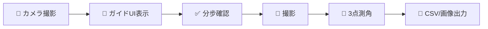
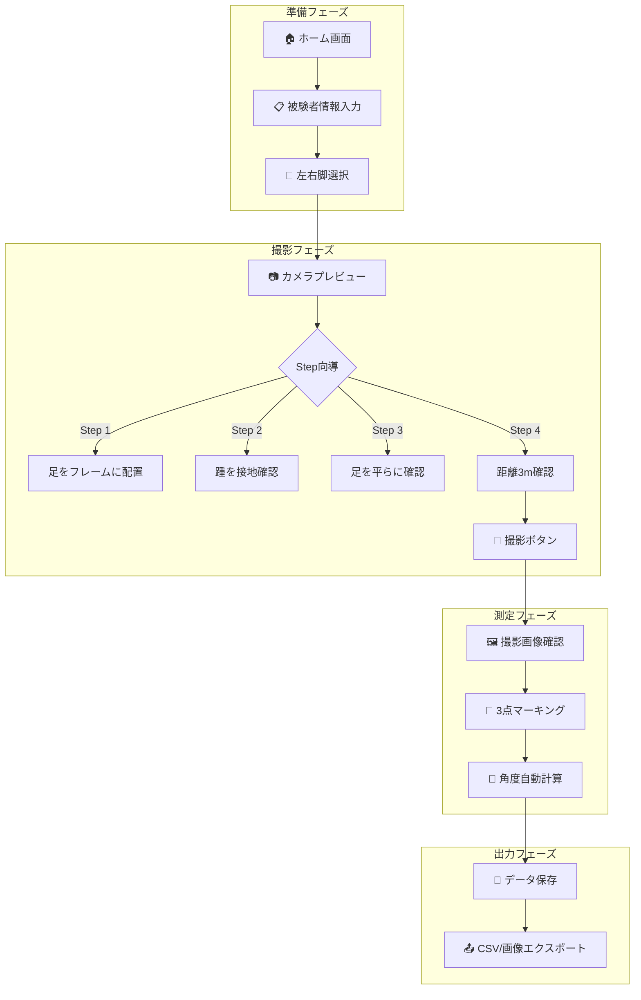
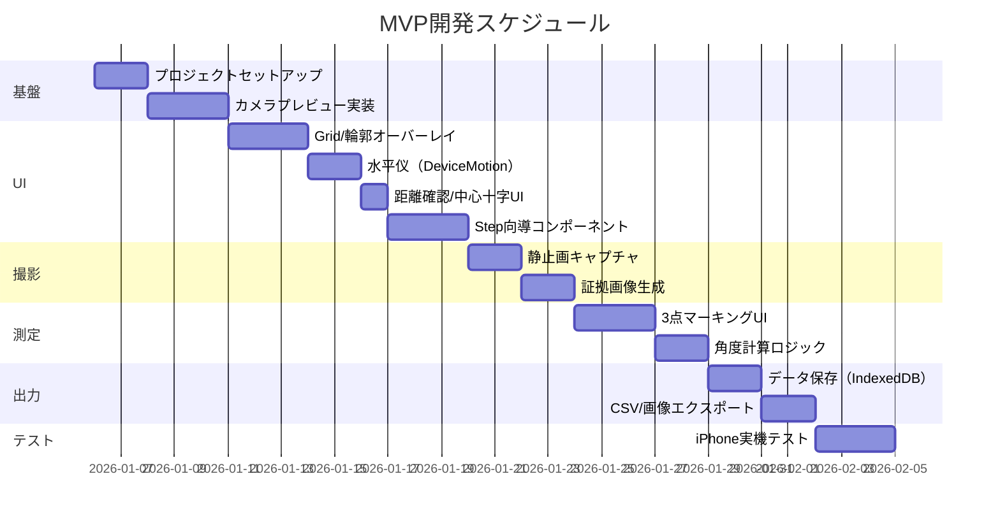

# 足関節角度測定 WebApp PRD（Product Requirements Document）

> **プロジェクト名**: AnkleCapture - 臨床・研究用足関節角度測定WebApp  
> **バージョン**: 1.0 (MVP)  
> **作成日**: 2026-01-05  
> **関連研究**: Image Jを用いた高齢者におけるバランスウッドを用いた足関節運動の即時効果の検討

---

## 1. エグゼクティブサマリー

### 1.1 背景と課題

現在の足関節角度測定プロセスには以下の課題がある：

| 現状の課題 | 詳細 |
|-----------|------|
| **測定の非標準化** | 撮影条件（距離、角度、姿勢）が撮影者によってばらつく |
| **手順の属人化** | 「足を地面につける」「膝を伸ばす」などの確認が口頭ベース |
| **データ分散** | 写真→ImageJ測定→手入力→Excel という多段階プロセスでエラーが発生しやすい |
| **トレーサビリティ不足** | どのような条件で撮影されたかの記録が残らない |

### 1.2 提案するソリューション

**iPhone向けWebApp**として、以下を一元化した測定システムを構築する：



---

## 2. 製品概要

### 2.1 製品ポジショニング

| 項目 | 内容 |
|------|------|
| **製品名** | AnkleCapture |
| **プラットフォーム** | iPhone Safari (WebApp, PWA対応可) |
| **対象ユーザー** | 理学療法士、研究者、臨床スタッフ |
| **主要価値** | 標準化された撮影条件＋再現可能な測定プロセス |

### 2.2 対象シナリオ（MVP）

> [!IMPORTANT]
> **MVP制約条件**
> - **デバイス**: iPhone のみ（後方カメラ使用）
> - **姿勢**: 座位のみ
> - **距離**: 3m（固定）
> - **マーカー**: 貴点（腓骨頭、外果、第5中足骨頭）を脚に事前貼付

---

## 3. ユーザーストーリーとフロー

### 3.1 主要ユーザーストーリー

```
As a 理学療法士,
I want to 標準化された条件で足関節写真を撮影したい,
So that 介入前後の比較が客観的にできる.

As a 研究者,
I want to 撮影条件と測定値を一括でエクスポートしたい,
So that データ管理の手間を削減できる.
```

### 3.2 画面フロー



---

## 4. 機能要件

### 4.1 カメラプレビュー画面

#### 4.1.1 基本機能

| 機能ID | 機能名 | 詳細 | 優先度 |
|--------|--------|------|--------|
| CAM-01 | 後方カメラプレビュー | `getUserMedia`で環境カメラ（後方）を取得、`<video playsinline muted autoplay>`で表示 | P0 |
| CAM-02 | 九宮格Grid表示 | 常時表示、2本の縦線＋2本の横線（画面を9分割） | P0 |
| CAM-03 | 足部輪郭ガイド | 左/右脚用のSVG輪郭（半透明）を中央に表示 | P0 |
| CAM-04 | 左右脚切替 | ボタンで左脚↔右脚のガイド輪郭を切替 | P0 |
| CAM-05 | 水平参照線 | 画面中央に固定水平線を表示（環境の水平線と合わせる用） | P0 |
| CAM-06 | 水平仪機能（DeviceMotion） | DeviceMotionEventでリアルタイム傾き検出、許容範囲±5° | **P0** |
| CAM-07 | 俯仰角インジケーター | 前後傾斜（Pitch）をリアルタイム表示、範囲外で警告 | **P0** |
| CAM-08 | 左右傾斜インジケーター | 左右傾斜（Roll）をリアルタイム表示、範囲外で警告 | **P0** |
| CAM-09 | 距離確認UI | 手動確認ダイアログ＋地板タイル参考ガイド表示 | **P0** |
| CAM-10 | 中心十字準星 | 画面中央に十字マーク、関節位置合わせ用 | **P0** |

#### 4.1.2 Overlay レイヤー構成

```
┌─────────────────────────────────┐
│     HTML Layer (指示文字)        │  z-index: 40
├─────────────────────────────────┤
│     Level Indicator (水平仪)     │  z-index: 35  ← NEW
├─────────────────────────────────┤
│     SVG Layer (足部輪郭)         │  z-index: 20
├─────────────────────────────────┤
│     Canvas Layer (Grid/水平線)   │  z-index: 10
├─────────────────────────────────┤
│     Video Layer (カメラ映像)      │  z-index: 0
└─────────────────────────────────┘
```

### 4.1.3 カメラ位置決め支援機能（MVP新規追加）

> [!IMPORTANT]
> **撮影条件の標準化**のため、以下の位置決め支援機能をMVPに含める

#### 水平仪（DeviceMotion）仕様

| 項目 | 仕様 |
|------|------|
| **検出軸** | Pitch（前後俯仰）、Roll（左右傾斜） |
| **許容範囲** | ±5°以内で「✓ 水平」と判定 |
| **更新頻度** | 60Hz（リアルタイム） |
| **UI表示** | 画面上部にインジケーターバー表示 |
| **警告表示** | 範囲外の場合、赤色で方向を矢印表示 |
| **撮影制限** | 水平でない場合も撮影可能（警告のみ） |

#### 水平仪 UI モックアップ

```
水平時（緑）                     傾斜時（赤）
┌──────────────────────┐       ┌──────────────────────┐
│  ●━━━━━━━●━━━━━━━●   │       │  ●━━━━━━━━━━━●━━━━●  │
│     ✓ 水平           │       │     ↗ 右に5°傾斜    │
└──────────────────────┘       └──────────────────────┘

俯仰角表示
┌──────────────────────┐       ┌──────────────────────┐
│       ═══●═══        │       │       ═══════●       │
│     ✓ 正面           │       │     ↓ 下に10°傾斜   │
└──────────────────────┘       └──────────────────────┘
```

#### 距離確認 UI

```
┌─────────────────────────────────────┐
│  🔶 距離確認                         │
│                                     │
│  📏 カメラと被験者の距離は約 3m ですか? │
│                                     │
│  💡 参考ガイド：                      │
│  ・一般的な床タイル（80cm）≈ 約4枚分   │
│  ・畳 1畳の長辺 ≈ 約180cm ≈ 約1.7畳分 │
│  ・腕を広げた幅 ≈ 約170cm ≈ 約1.8倍   │
│                                     │
│   [ 近すぎる ]  [ ✓ 適切 ]  [ 遠すぎる ] │
└─────────────────────────────────────┘
```

#### 中心十字準星

```
画面中央に常時表示（関節を中心に合わせる）

         │
    ─────┼─────
         │

・線の色: 半透明白 (rgba(255,255,255,0.7))
・線の太さ: 2px
・線の長さ: 画面幅/高さの 10%
```

### 4.2 分步向導（Step-by-Step Guidance）

> [!NOTE]
> 各ステップで**確認ボタンを押す**ことで、条件確認の記録が残る仕組み

| Step | 確認項目 | 表示テキスト | データ記録 |
|------|----------|--------------|------------|
| 1 | 足配置 | 「足をガイド枠内に配置してください」 | `foot_in_frame: true/false` |
| 2 | 踵接地 | 「踵が床に接地していることを確認」 | `heel_on_ground: true/false` |
| 3 | 足平坦 | 「足が平らになっていることを確認」 | `foot_flat: true/false` |
| 4 | 距離確認 | 「被験者との距離が3mであることを確認」 | `distance_confirmed: true/false` |
| 5 | 撮影 | 「シャッターボタンを押して撮影」 | `capture_timestamp` |

### 4.3 撮影・画像処理

| 機能ID | 機能名 | 詳細 | 優先度 |
|--------|--------|------|--------|
| IMG-01 | 静止画キャプチャ | `video` → `canvas` → `toDataURL()` | P0 |
| IMG-02 | 原画像保存 | 撮影時点の画像をそのまま保存 | P0 |
| IMG-03 | オーバーレイ画像生成 | Grid、輪郭、確認項目を重ねた「証拠画像」を生成 | P0 |
| IMG-04 | 画像品質設定 | 解像度指定（推奨: 1920x1080以上） | P1 |

### 4.4 3点測角機能（撮影後画面）

| 機能ID | 機能名 | 詳細 | 優先度 |
|--------|--------|------|--------|
| ANG-01 | ポイントマーキング | 画像上で3点（腓骨頭、外果、第5中足骨頭）をタップ/ドラッグで指定 | P0 |
| ANG-02 | 角度自動計算 | 3点から角度を計算（2直線のなす角） | P0 |
| ANG-03 | 角度表示 | 計算結果を画像上にオーバーレイ表示 | P0 |
| ANG-04 | ポイント修正 | マーキング位置をドラッグで微調整可能 | P1 |
| ANG-05 | 複数角度対応 | 膝窩角度、足関節背屈角度の2種類に対応 | P1 |

### 4.5 データ記録・エクスポート

#### 4.5.1 記録データ構造

```javascript
{
  // 被験者情報
  "subject_id": "P001",
  "session_id": "uuid-xxxx",
  "operator_id": "OT_yamada",
  
  // 測定条件
  "side": "L",           // L/R
  "posture": "sitting",  // sitting/standing
  "distance_m": 3.0,
  "measurement_type": "ankle_dorsiflexion", // popliteal_angle / ankle_dorsiflexion
  
  // 確認チェックリスト
  "checklist": {
    "foot_in_frame": true,
    "heel_on_ground": true,
    "foot_flat": true,
    "distance_confirmed": "appropriate"  // "too_close" / "appropriate" / "too_far"
  },
  
  // デバイス姿勢（撮影時に自動記録）
  "device_orientation": {
    "pitch_deg": 1.2,           // 前後俯仰角度（±5°が許容範囲）
    "roll_deg": -0.8,           // 左右傾斜角度（±5°が許容範囲）
    "is_level": true,           // 許容範囲内かどうか
    "level_tolerance_deg": 5.0  // 許容範囲の設定値
  },
  
  // 測定結果
  "points": [
    {"label": "fibular_head", "x": 234, "y": 156},
    {"label": "lateral_malleolus", "x": 245, "y": 312},
    {"label": "5th_metatarsal", "x": 312, "y": 345}
  ],
  "angle_value": 18.5,
  
  // メタデータ
  "timestamp": "2026-01-05T14:32:15+09:00",
  "device_info": "iPhone 14 Pro / Safari 17.2",
  
  // ファイル参照
  "original_photo": "P001_L_20260105_143215_raw.png",
  "overlay_photo": "P001_L_20260105_143215_overlay.png"
}
```

#### 4.5.2 エクスポート形式

| 形式 | 内容 | 用途 |
|------|------|------|
| CSV | 全測定記録の一覧 | 統計解析（R, SPSS等） |
| JSON | 詳細データ（上記構造） | システム連携・バックアップ |
| PNG（原画像） | 撮影時の元画像 | アーカイブ |
| PNG（証拠画像） | Grid＋角度＋確認項目オーバーレイ | 論文掲載・監査証跡 |

---

## 5. UI/UX設計

### 5.1 デザイン原則

| 原則 | 説明 |
|------|------|
| **臨床現場優先** | 手袋着用でも操作可能な大きなボタン |
| **エラー防止** | Step完了しないと次に進めない |
| **視認性** | 高コントラスト、大きめフォント |
| **シンプル** | 1画面1タスク |

### 5.2 カラーパレット

```css
:root {
  --primary: #2563EB;      /* 青系: メインアクション */
  --success: #10B981;      /* 緑: 確認完了 */
  --warning: #F59E0B;      /* 橙: 注意喚起 */
  --danger: #EF4444;       /* 赤: エラー・未確認 */
  --neutral-bg: #1F2937;   /* ダークグレー: 背景 */
  --overlay: rgba(0,0,0,0.5); /* 半透明オーバーレイ */
}
```

### 5.3 足部輪郭ガイド（SVG仕様）

```svg
<!-- 左足の簡略輪郭（例） -->
<svg viewBox="0 0 200 300" xmlns="http://www.w3.org/2000/svg">
  <path 
    d="M100,20 Q60,80 50,150 Q45,200 60,250 Q80,280 100,290 Q120,280 140,250 Q155,200 150,150 Q140,80 100,20 Z"
    fill="none"
    stroke="rgba(37, 99, 235, 0.7)"
    stroke-width="3"
    stroke-dasharray="10,5"
  />
  <!-- 3点マーカー位置（目安） -->
  <circle cx="80" cy="60" r="8" fill="#EF4444" opacity="0.8"/> <!-- 腓骨頭 -->
  <circle cx="90" cy="200" r="8" fill="#EF4444" opacity="0.8"/> <!-- 外果 -->
  <circle cx="140" cy="270" r="8" fill="#EF4444" opacity="0.8"/> <!-- 第5中足骨頭 -->
</svg>
```

### 5.4 画面モックアップ概要

#### カメラプレビュー画面

```
┌────────────────────────────────────┐
│  [≡]  AnkleCapture   [左脚 ▼]     │ ← ヘッダー
├────────────────────────────────────┤
│                                    │
│      ╔════════════════════╗        │
│      ║    │       │       ║        │
│      ║────┼───────┼───────║        │ ← Grid (九宮格)
│      ║    │  🦶   │       ║        │ ← 足輪郭ガイド
│      ║────┼───────┼───────║        │
│      ║    │       │       ║        │
│      ╚════════════════════╝        │
│  ─────────────────────────────     │ ← 水平参照線
│                                    │
├────────────────────────────────────┤
│  Step 2/4: 踵が接地していますか?    │ ← 指示テキスト
│                                    │
│   [ 戻る ]          [ ✓ 確認 ]     │ ← ナビゲーション
├────────────────────────────────────┤
│            [ 📷 撮影 ]              │ ← 撮影ボタン（Step完了後有効化）
└────────────────────────────────────┘
```

---

## 6. 技術仕様

### 6.1 技術スタック

| レイヤー | 技術 | 理由 |
|---------|------|------|
| **フロントエンド** | Vanilla JS + HTML5 + CSS3 | 軽量、Safari互換性重視 |
| **カメラAPI** | WebRTC `getUserMedia` | iPhone Safari対応済み |
| **描画** | Canvas 2D + SVG | Grid/測定線にCanvas、輪郭にSVG |
| **ストレージ** | IndexedDB + LocalStorage | オフライン対応 |
| **ホスティング** | GitHub Pages / Vercel | HTTPS必須のため |

### 6.2 iPhone Safari 注意事項

> [!WARNING]
> **iOS固有の制約**
> 1. **HTTPS必須**: `getUserMedia`はセキュア環境でのみ動作
> 2. **ユーザージェスチャー必須**: カメラ起動はボタンクリック等から
> 3. **playsinline必須**: `<video>`に`playsinline`属性がないとフルスクリーン強制
> 4. **DeviceMotion権限**: iOS 13+では`DeviceMotionEvent.requestPermission()`が必要

### 6.3 コア実装サンプル

#### カメラ初期化

```javascript
async function initCamera() {
  const constraints = {
    video: {
      facingMode: { ideal: "environment" },
      width: { ideal: 1920 },
      height: { ideal: 1080 }
    },
    audio: false
  };
  
  try {
    const stream = await navigator.mediaDevices.getUserMedia(constraints);
    const video = document.getElementById('camera-preview');
    video.srcObject = stream;
    await video.play();
    return true;
  } catch (err) {
    console.error('Camera access denied:', err);
    return false;
  }
}
```

#### Grid描画

```javascript
function drawGrid(canvas) {
  const ctx = canvas.getContext('2d');
  const w = canvas.width;
  const h = canvas.height;
  
  ctx.clearRect(0, 0, w, h);
  ctx.strokeStyle = 'rgba(255, 255, 255, 0.6)';
  ctx.lineWidth = 1;
  
  // 縦線 2本
  ctx.beginPath();
  ctx.moveTo(w / 3, 0);
  ctx.lineTo(w / 3, h);
  ctx.moveTo((w * 2) / 3, 0);
  ctx.lineTo((w * 2) / 3, h);
  
  // 横線 2本
  ctx.moveTo(0, h / 3);
  ctx.lineTo(w, h / 3);
  ctx.moveTo(0, (h * 2) / 3);
  ctx.lineTo(w, (h * 2) / 3);
  
  ctx.stroke();
}
```

#### 角度計算

```javascript
function calculateAngle(p1, p2, p3) {
  // p2を頂点として、p1-p2とp2-p3のなす角度を計算
  const v1 = { x: p1.x - p2.x, y: p1.y - p2.y };
  const v2 = { x: p3.x - p2.x, y: p3.y - p2.y };
  
  const dot = v1.x * v2.x + v1.y * v2.y;
  const mag1 = Math.sqrt(v1.x * v1.x + v1.y * v1.y);
  const mag2 = Math.sqrt(v2.x * v2.x + v2.y * v2.y);
  
  const cosAngle = dot / (mag1 * mag2);
  const angleRad = Math.acos(Math.max(-1, Math.min(1, cosAngle)));
  const angleDeg = angleRad * (180 / Math.PI);
  
  return Math.round(angleDeg * 10) / 10; // 小数点1位まで
}
```

#### 水平仪（DeviceMotion）実装

```javascript
// 許容範囲の定数
const LEVEL_TOLERANCE_DEG = 5.0;

// iOS 13+ では明示的な権限リクエストが必要
async function requestMotionPermission() {
  if (typeof DeviceOrientationEvent.requestPermission === 'function') {
    try {
      const permission = await DeviceOrientationEvent.requestPermission();
      return permission === 'granted';
    } catch (err) {
      console.error('Motion permission denied:', err);
      return false;
    }
  }
  return true; // 非iOS または 旧バージョン
}

// 水平仪の初期化（ユーザー操作後に呼び出す）
async function initLevelIndicator() {
  const granted = await requestMotionPermission();
  if (!granted) {
    showPermissionDeniedMessage();
    return false;
  }
  
  window.addEventListener('deviceorientation', handleOrientation, true);
  return true;
}

// 傾き検出ハンドラ
function handleOrientation(event) {
  // beta: 前後の傾き（-180 ~ 180）、gamma: 左右の傾き（-90 ~ 90）
  const pitch = event.beta;   // 俯仰角
  const roll = event.gamma;   // 左右傾斜
  
  // 横向き撮影時の補正（必要に応じて）
  const adjustedPitch = pitch !== null ? pitch - 90 : null;  // 撮影時は90°が正面
  
  // 水平判定
  const isLevel = 
    adjustedPitch !== null && 
    roll !== null &&
    Math.abs(adjustedPitch) <= LEVEL_TOLERANCE_DEG && 
    Math.abs(roll) <= LEVEL_TOLERANCE_DEG;
  
  // UI更新
  updateLevelIndicatorUI(adjustedPitch, roll, isLevel);
  
  // 撮影時用にグローバルに保持
  window.currentOrientation = {
    pitch_deg: adjustedPitch,
    roll_deg: roll,
    is_level: isLevel,
    level_tolerance_deg: LEVEL_TOLERANCE_DEG
  };
}

// UI更新
function updateLevelIndicatorUI(pitch, roll, isLevel) {
  const indicator = document.getElementById('level-indicator');
  const pitchBar = document.getElementById('pitch-bar');
  const rollBar = document.getElementById('roll-bar');
  
  if (isLevel) {
    indicator.className = 'level-ok';
    indicator.textContent = '✓ 水平';
  } else {
    indicator.className = 'level-warning';
    // 方向を矢印で表示
    const pitchDir = pitch > LEVEL_TOLERANCE_DEG ? '↓' : pitch < -LEVEL_TOLERANCE_DEG ? '↑' : '';
    const rollDir = roll > LEVEL_TOLERANCE_DEG ? '→' : roll < -LEVEL_TOLERANCE_DEG ? '←' : '';
    indicator.textContent = `${pitchDir}${rollDir} 調整してください`;
  }
  
  // インジケーターバーの位置を更新
  if (pitchBar) pitchBar.style.transform = `translateY(${pitch * 2}px)`;
  if (rollBar) rollBar.style.transform = `translateX(${roll * 2}px)`;
}
```

---

## 7. 開発ロードマップ

### 7.1 Phase 1: MVP（4週間）



> [!NOTE]
> **MVP工数変更**: 水平仪機能の追加により、約+2日（UIフェーズに統合）

### 7.2 Phase 2: 拡張機能（Phase 1完了後）

| 機能 | 概要 | 工数目安 |
|------|------|----------|
| 膝窩角度対応 | 測定種別の追加 | 3日 |
| クラウド同期 | Firebase等との連携 | 2週間 |
| 複数被験者管理 | 被験者リスト・履歴管理 | 1週間 |
| AI骨格検出 | MediaPipe Pose統合（実験的） | 2週間 |
| 参照物自動距離計算 | 既知サイズマーカーで距離推定 | 1週間 |

---

## 8. 検収基準

### 8.1 機能検収

| ID | 検収項目 | 合格基準 |
|----|----------|----------|
| AC-01 | カメラ起動 | iPhone Safari 17+でボタンクリック後3秒以内にプレビュー表示 |
| AC-02 | Grid表示 | 九宮格が画面サイズに追従して正しく表示 |
| AC-03 | Step完了 | 全4Stepを確認しないと撮影ボタンが有効化されない |
| AC-04 | 撮影 | ボタン押下で1秒以内に静止画がキャプチャされる |
| AC-05 | 3点指定 | 画像上で3点をタップ指定でき、移動・修正が可能 |
| AC-06 | 角度計算 | 指定3点から角度が計算され、小数点1位まで表示 |
| AC-07 | CSV出力 | 記録データが正しいフォーマットでダウンロードされる |
| AC-08 | 証拠画像 | Grid、角度、チェック項目が重畳されたPNGが出力される |
| AC-09 | 水平仪権限 | DeviceMotion権限リクエストがユーザー操作後に表示される |
| AC-10 | 水平仪表示 | 傾斜角度がリアルタイム（60Hz）で更新される |
| AC-11 | 水平判定 | ±5°以内で緑色「✓水平」、範囲外で赤色＋方向矢印 |
| AC-12 | 距離確認 | 「近すぎる/適切/遠すぎる」の3択で確認記録される |
| AC-13 | 中心十字 | 画面中央に常時十字マークが表示される |
| AC-14 | 姿勢記録 | 撮影時のPitch/Roll値がデータに自動記録される |

### 8.2 非機能検収

| ID | 検収項目 | 合格基準 |
|----|----------|----------|
| NF-01 | レスポンス | 全操作が2秒以内に応答 |
| NF-02 | オフライン | 一度読み込めばネットワーク切断後も動作 |
| NF-03 | データ永続性 | ブラウザを閉じても記録データが消えない |

---

## 9. リスクと対策

| リスク | 影響度 | 対策 |
|--------|--------|------|
| iOS Safari API変更 | 高 | Safari Release Notesを定期確認 |
| 照明条件による視認性低下 | 中 | Grid/輪郭の色・太さを調整可能に |
| 距離3m確保困難な環境 | 中 | 距離選択機能を追加（Phase 2） |
| 高齢者の操作困難 | 中 | 大きなボタン、シンプルなフロー |

---

## 10. 用語集

| 用語 | 説明 |
|------|------|
| **膝窩角度** | 膝を伸ばした状態で、外果と腓骨頭を結ぶ線が水平線となす角度 |
| **足関節背屈角度** | 腓骨頭-外果-第5中足骨頭で形成される角度 |
| **ImageJ** | NIH製の画像解析ソフトウェア |
| **getUserMedia** | WebRTC APIの一つでカメラ・マイクにアクセス |
| **PWA** | Progressive Web App、ネイティブアプリのようにインストール可能なWebApp |

---

## 11. 参考文献

1. 中嶋 風華, 中山 智晴, 山﨑 裕司: Image Jを用いた関節可動域測定における検者内再現性の検討. 高知リハビリテーション専門職大学紀要 4:23-26, 2023.
2. [MDN Web Docs - getUserMedia](https://developer.mozilla.org/en-US/docs/Web/API/MediaDevices/getUserMedia)
3. [WebKit Blog - WebRTC on Safari](https://webkit.org/blog/11353/webrtc-in-safari-14-and-ios-14/)

---

## 付録A: 関連ファイル

| ファイル | 説明 |
|----------|------|
| [draft_paper.md](file:///Users/tianyihan/repository/4-BW_image-J/draft_paper.md) | 本PRDの元となる研究論文ドラフト |

---

> **次のステップ**
> 1. このPRDのレビュー・承認
> 2. デザインモックアップ作成（Figma等）
> 3. Phase 1 MVP開発着手
