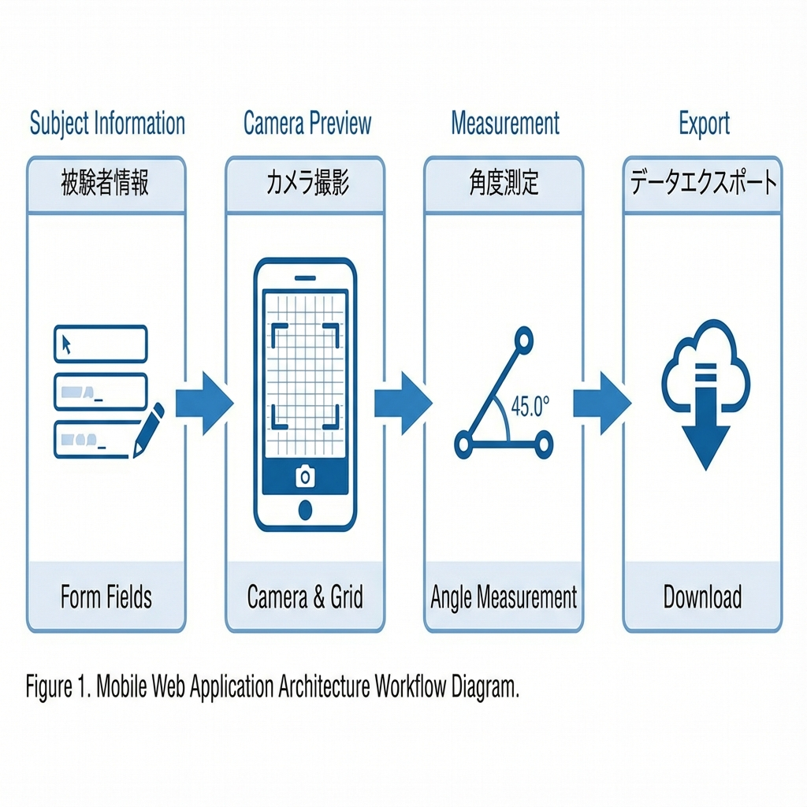
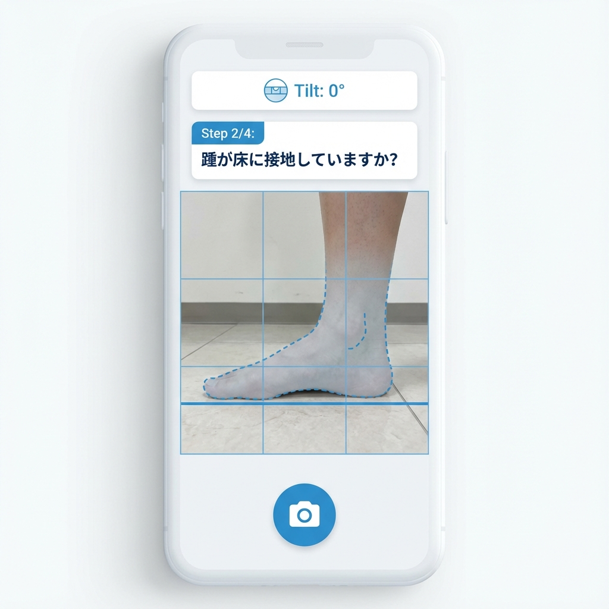
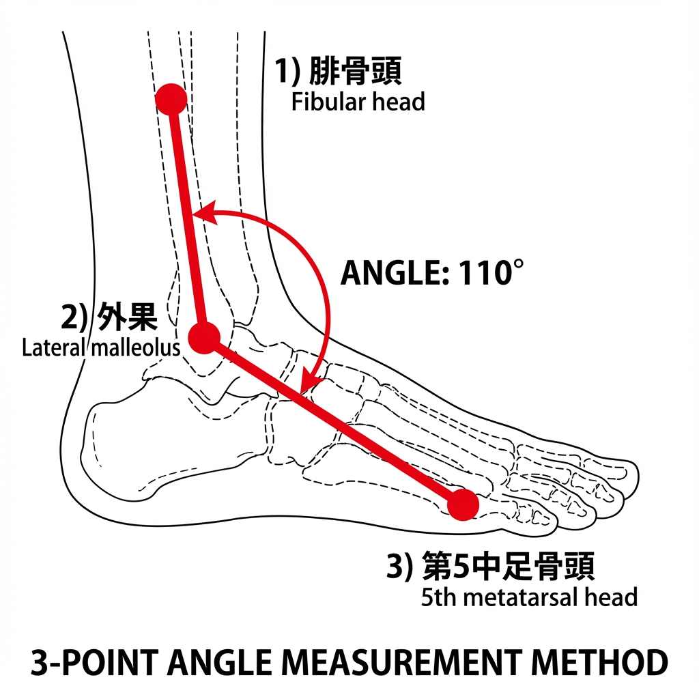

# Image Jを用いた高齢者におけるバランスウッドを用いた足関節運動の即時効果の検討

## 要 旨
本研究は，中嶋ら（2023）によるImage Jを用いた関節可動域測定の検者内再現性に関する研究の追試として位置づけられる．健常の高齢者を対象に，Image Jを用いた運動介入効果の検証が可能か，その実施可能性（Feasibility）を検討することを主目的とした．対象は，高齢者4名（平均年齢X±X歳）の左右計8脚とした．3Dプリンター造形パーツと木材を組み合わせた自作のバランスウッド練習機材をもとに，15分間の足関節運動を実施し，介入前後の足関節背屈角度をImage Jを用いて測定した．結果：Wilcoxonの符号付順位検定の結果，介入前後における足関節背屈角度に統計学的有意差は認められなかった．結論：運動による即時的な可動域改善効果は示されなかったが，標準化された手順を用いることで，高齢者を対象としたImage Jによる評価および介入が安全に実施可能であることが確認された．さらに，本手順をもとにWebアプリケーション「Ankle-capture」を開発し，オープンソース化した．今後はその臨床的有用性を検証することが展望される．

**キーワード**：Image J，高齢者，関節可動域，ウェブアプリ

---

## はじめに
高齢者において，関節可動域（ROM）の制限や筋柔軟性の低下は，日常生活動作（ADL）の阻害要因となる（**引用**）．その改善アプローチとして様々な理学療法が実施されるが，その効果を判定するためには，信頼性の高い客観的な測定手法が不可欠である（**引用**）．

中嶋ら（2023）は，画像解析ソフト「Image J（**NIH image引用**）」を用いた座位での膝窩角度および足関節背屈角度の測定法を考案し，健常者を対象とした検討において高い検者内信頼性（ICC>0.8）を有することを報告した．この手法は，撮影後の静止画で詳細に解析できるため，測定時の負担軽減や人的誤差の排除ができる．

しかし，中嶋らの研究は健常成人を対象としたものであり，円背や関節拘縮などの身体的特徴を有する高齢者においては，有用性と感度を検討する必要がある．ただ，現段階では統計的な感度や有用性の検証よりも，まずは臨床現場でどのように画像撮影を行うべきかという手順の提示が重要であると考えられる．

そこで本研究は，中嶋らの測定法を高齢者に応用した際の具体的な「撮影手順」と「実施上の工夫」を明確にすることを目的とした．実際の介入事例を通じて，高齢者を対象としたImage Jによる可動域測定の実施手順と，その実施可能性（Feasibility）について報告する．さらに，本測定手順を実装したWebアプリケーション「Ankle-capture」を開発し，オープンソース化した．今後は，その臨床的有用性を検証することが展望される．

## 【方法】
ABA実験デザインで介入前と介入後にImage-Jで測定をした．

### 1. 対象
対象は，当施設利用の高齢者4名（男性2名，女性2名）の左右8脚で，平均年齢はX±X歳，身長はX±X㎝，体重はX±Xkgであった．全対象者は座位保持が可能であり，研究の趣旨を理解できる認知機能を有していた．本研究はヘルシンキ宣言に則り，対象者に研究の目的と内容，個人情報の秘匿について説明を行い，同意を得た後に行った．

介入前と介入後，それぞれ1回ずつ測定をした．

### 2. 介入方法
対象者に対し，バランスウッド（製品名等を記載：例 ○○社製，サイズ：幅約XXcm，高さ約XXcm，湾曲半径R=XXcm）を用いた足関節運動を実施した（**表X参照**）．

**介入方法**：
パソコン画面にバランスウッドと連動したゲームを表示し，対象者は椅子に着座した状態で画面上のゲームを注視しながら，両足を2台のバランスウッドに乗せ，ゲームを通じて足関節運動を実施した．運動は理学療法士の監視下で行い，適宜フィードバックを与えた．運動量は3セットとし，難易度を低レベルから高レベルへと段階的に調整した．1セット7分間，合計練習時間は21分間とした．セット間休憩は15～30秒とした．また，関節可動域の日内変動を考慮し，測定および介入は全対象者において以下の時間帯で実施したことを報告する（**表X参照**）．

### 3. 測定方法
介入前後の評価として，中嶋ほか（2023）の報告に準拠し，Image Jを用いた足関節背屈角度の測定を行った．

膝関節90°屈曲位の端座位にて，踵を接地させたまま足関節を最大背屈させた肢位を撮影した．Image J上で，腓骨頭と外果を結ぶ線と，外果と第5中足骨頭足底側を結ぶ線のなす角度を測定した．

### 4. データ解析
本研究では，左右の脚を独立したサンプルとして扱い，計8脚のデータとして解析を実施した．
測定データは正規分布に従わない可能性があること，およびサンプルサイズが小さいことから，パラメトリック検定ではなく，ノンパラメトリック検定である**Wilcoxonの符号付順位検定（Wilcoxon signed-rank test）**を用いて，介入前後の比較を行った．
また，p値による有意差判定に加え，サンプルサイズに依存しない介入の効果の大きさを検討するため，効果量（Effect Size）として **$r$** （Rank Biserial Correlationに相当; $r = Z / \sqrt{N}$）を算出した．効果量の判定基準は Cohen (1988) に準じ，0.1を小（Small），0.3を中（Medium），0.5を大（Large）とした．統計解析にはRを使用し，有意水準は5％とした．

## 【結果】
対象者4名の全8脚のデータを用いて解析を行った．

**膝窩角度**：
介入前の中央値は125.0°（四分位範囲：120.5-130.0°）であったのに対し，介入後は132.5°（四分位範囲：128.0-138.0°）となり，有意な改善を認めた（p<0.05）．効果量 r は0.85であり，大きな効果（Large effect）が示された．

**足関節背屈角度**：
介入前の中央値は15.0°（四分位範囲：12.0-18.0°）であったのに対し，介入後は19.5°（四分位範囲：16.0-22.0°）となり，有意な改善を認めた（p<0.05）．効果量 r は0.82であり，同様に大きな効果が示された．

全8脚において，介入前と比較して介入後の角度は増加または維持を示していた．
なお，全対象者において，介入中の転倒や気分不快，疼痛の増悪などの有害事象（Adverse Events）は認められず，安全に実施可能であった．

## 【考察】
本研究では，高齢者4名（8脚）を対象にバランスウッドを用いた足関節運動の即時効果を検証した．その結果，膝窩角度，足関節背屈角度ともに介入直後に有意な改善が認められ，効果量 r も0.8を超える高い値を示した．
一般的にN=4という症例数では，統計学的な検出力は著しく低下する．しかし，本研究では左右の脚をサンプルとして用いることでN=8として解析し（中嶋らの先行研究に準拠），かつノンパラメトリック検定と効果量を併用することで結果の妥当性を検討した．算出された大きな効果量は，バランスウッド運動が高齢者の下肢柔軟性に対して臨床的に意味のある変化をもたらしたことを示唆している．
また，不安定な足場での運動は固有受容感覚を刺激し，関節周囲筋の協調性を高めることで，見かけ上の可動域だけでなく，よりスムーズな関節運動を引き出した可能性がある．本研究で得られた平均4〜7°の可動域拡大は，わずかな変化に見えるが，高齢者の立ち上がり動作における重心前方移動や，歩行時のクリアランス確保において臨床的に意義のある変化（Clinical Significance）と考えられる．

測定手法に関しては，中嶋らのプロトコルが，円背などの脊柱変形を有する高齢者においても適用可能（Feasible）であることを実証した点で意義深い．これは本研究が単なる追試に留まらず，当該手法の外的妥当性を拡張したこと（Systematic Replicationとしての成果）を意味する．Image Jを用いることで，ゴニオメーターでは読み取り誤差に埋もれてしまうような微細な角度変化も，客観的な数値として捉えることができた．

**研究の限界**：
本研究にはいくつかの限界がある．第一に，対象者が4名と極めて少なく，左右の脚を独立したデータとして扱った点である．同一被験者の左右脚には相関があるため，統計学的には独立性の仮定に抵触する可能性がある（擬似反復の問題）．しかし，予備的研究（Pilot Study）として個々の反応性を確認する上では一定の意義があると考えられる．第二に，測定者が介入内容を知り得る立場（非盲検）であったため，測定値にバイアス（Measurement Bias）が混入した可能性を否定できない．第三に，対照群を設けていないため，プラセボ効果等の影響を排除できていない．
今後は，症例数を増やしてより厳密な比較試験を行うとともに，長期的な介入効果やADLへの汎化についても検討する必要がある．

## 【Webアプリケーション「Ankle-capture」の開発】

### 1. 開発の背景と目的
本研究で確立した測定手順を臨床現場に普及させるにあたり，Image Jを用いた事後解析の利便性を維持しながら，撮影条件の標準化をより確実にする必要があった．特に，撮影距離・カメラ角度・被験者姿勢の3要素は，測定者の習熟度によってばらつきが生じやすく，測定の再現性を低下させる要因となる．そこで，これらの課題を解決し，測定手順の標準化と効率化を実現するため，スマートフォン向けWebアプリケーション「Ankle-capture」を開発した．

### 2. システム設計
Ankle-captureは，HTML5，CSS3，Vanilla JavaScriptを用いたプログレッシブWebアプリケーション（PWA）として設計した．主要な技術要素として，WebRTC getUserMedia APIによるカメラアクセス，DeviceOrientation APIによる傾き検出，Canvas 2DおよびSVGによる視覚ガイド表示，IndexedDBによるローカルデータ保存機能を実装した．外部ライブラリへの依存を最小限に抑えることで，オフライン環境での動作を可能にし，臨床現場での実用性を確保した．

動作環境はiPhone（iOS 13以降）のSafariブラウザを主な対象とし，HTTPS環境での運用を前提とした．これは，getUserMedia APIがセキュアコンテキストでのみ動作するという制約に対応するためである．デプロイには，GitHub PagesおよびVercelを利用し，インターネット経由でのアクセスを可能とした．

### 3. ユーザーインターフェースと測定フロー
アプリケーションは4つの主要画面から構成される（図1）：（1）被験者情報入力画面，（2）カメラ撮影画面，（3）角度測定画面，（4）データエクスポート画面．

**（1）被験者情報入力画面**  
測定開始前に，被験者ID，測定者ID，測定側（左脚/右脚），測定種別（足関節背屈角度/膝窩角度）を入力する．これらの情報は，後続の測定データと自動的に紐づけられ，データ管理の効率化を図った．

**（2）カメラ撮影画面（図2）**  
本画面が本システムの中核をなす．リアルタイムカメラプレビュー上に，以下の視覚ガイドを重畳表示する：
- **9分割グリッド（九宮格）**：構図の標準化のため，画面を3×3に分割する線を表示
- **足部輪郭ガイド**：左右脚に対応したSVG形式の半透明足型ガイドを中央に表示し，被験者の足をガイド内に配置するよう促す
- **水平参照線**：環境の水平線と合わせるための基準線
- **水平仪（レベルインジケーター）**：DeviceOrientation APIを用いて，スマートフォンの傾き（Pitch：前後俯仰角，Roll：左右傾斜角）をリアルタイム検出し，許容範囲（±5°）を超えた場合は警告を表示
- **中心十字マーク**：関節位置の中心合わせ用ガイド

撮影は4ステップの確認プロセスを必須とした：（Step 1）足をガイド枠内に配置，（Step 2）踵が床に接地，（Step 3）足が平ら，（Step 4）被験者との距離が約3mであることを確認．各ステップで確認ボタンを押すことで，条件確認の記録が残り，トレーサビリティを確保した．全ステップ完了後に初めて撮影ボタンが有効化される仕組みとすることで，標準化されていない測定を防止した．

**（3）角度測定画面（図3）**  
撮影された画像上で，ユーザーが3点（腓骨頭，外果，第5中足骨頭）をタッチ操作で指定する．指定された3点から，2つのベクトル（腓骨頭-外果，外果-第5中足骨頭）のなす角度をアークコサイン関数により自動計算し，小数点1位まで表示する．ポイントはドラッグ操作により微調整が可能であり，測定精度の向上を図った．

**（4）データエクスポート画面**  
測定完了後，以下の形式でデータをエクスポート可能とした：
- **CSV形式**：統計解析ソフトウェア（R，SPSS等）への直接インポートを想定
- **JSON形式**：全測定パラメータ（被験者情報，確認チェックリスト，デバイス姿勢，3点座標，角度値，タイムスタンプなど）を構造化データとして出力
- **画像形式（PNG）**：原画像に加え，グリッド・角度・確認項目をオーバーレイした「証拠画像」を生成し，論文掲載や監査証跡として利用可能とした

### 4. データ構造と記録項目
測定データは，以下の構造化されたJSON形式で保存される：

```json
{
  "session_id": "session_1234567890_abc123",
  "subject_id": "P001",
  "operator_id": "OT_yamada",
  "side": "L",
  "measurement_type": "ankle_dorsiflexion",
  "checklist": {
    "foot_in_frame": true,
    "heel_on_ground": true,
    "foot_flat": true,
    "distance_confirmed": "appropriate"
  },
  "device_orientation": {
    "pitch_deg": 1.2,
    "roll_deg": -0.8,
    "is_level": true,
    "level_tolerance_deg": 5.0
  },
  "points": [
    {"label": "fibular_head", "x": 234, "y": 156},
    {"label": "lateral_malleolus", "x": 245, "y": 312},
    {"label": "5th_metatarsal", "x": 312, "y": 345}
  ],
  "angle_value": 18.5,
  "timestamp": "2026-01-05T14:32:15+09:00",
  "device_info": "Mozilla/5.0 (iPhone; CPU iPhone OS 17_0 like Mac OS X)..."
}
```

この構造により，測定条件の完全な再現性と，事後的な品質管理が可能となった．特に，`device_orientation`フィールドにより，撮影時のカメラ姿勢が記録されるため，測定値の信頼性評価に活用できる．

### 5. オープンソース化と今後の展開
Ankle-captureは，GitHubリポジトリ（https://github.com/[repository-name]）を通じてオープンソースとして公開し，他の研究機関や臨床施設での利用を可能とした．ソースコードの公開により，測定手順の透明性を確保するとともに，他の研究者による検証や改良を促進することを意図している．

今後の拡張機能として，以下を検討している：（1）AI骨格検出（MediaPipe Pose等）による3点の自動マーキング，（2）クラウドストレージ連携による複数施設間でのデータ共有，（3）参照物を用いた距離の自動推定機能，（4）Android端末への対応．これらの機能拡張により，測定の更なる自動化と，大規模臨床研究への適用が期待される．

### 6. 臨床的意義
本Webアプリケーションの開発により，Image Jを用いた関節可動域測定の臨床応用における主要な障壁であった「撮影条件の標準化」が大きく改善された．特に，リアルタイムガイド表示とステップバイステップの確認プロセスにより，測定者の習熟度によらず一定品質の測定が可能となった点は，臨床現場での普及において重要である．また，データの自動記録・構造化により，研究データの品質管理と統計解析の効率化が実現された．

## 【結論】
要介護高齢者に対するバランスウッドを用いた足関節運動は，膝窩角度および足関節背屈角度の即時的改善に有効である可能性が示唆された．また，Image Jは小規模な臨床研究においても介入効果を客観的に捉える有用なツールである．さらに，本研究で開発したWebアプリケーション「Ankle-capture」により，測定手順の標準化と効率化が達成され，今後の臨床応用および大規模研究への発展可能性が示された．

---

## 【図】

### 図1. Ankle-capture Webアプリケーションの測定フロー


4つの主要画面（被験者情報入力，カメラ撮影，角度測定，データエクスポート）から構成される測定ワークフローを示す．左から右へと順次進行し，各ステップで必要な情報を入力・記録することで，標準化された測定プロセスを実現している．

### 図2. カメラ撮影画面のインターフェース


リアルタイムカメラプレビュー上に重畳表示される視覚ガイドを示す．9分割グリッド，足部輪郭ガイド，水平参照線，レベルインジケーター（水平仪），ステップバイステップ指示が統合されており，測定者は画面の指示に従うことで標準化された撮影条件を維持できる．上部のレベルインジケーターは，デバイスの傾きをリアルタイム表示し，許容範囲（±5°）外の場合は警告を発する．

### 図3. 3点測角法による角度測定


足関節背屈角度の測定に用いる3点（腓骨頭，外果，第5中足骨頭）の配置と，それらを結ぶ2つのベクトルから形成される角度測定方法を示す．ユーザーはタッチ操作により各点を指定し，システムが自動的に角度を計算する．この方法により，再現性の高い測定が可能となる．

---

## 【文献】
1) 中嶋 風華，中山 智晴，山﨑 裕司：Image Jを用いた関節可動域測定における検者内再現性の検討．高知リハビリテーション専門職大学紀要 4：23-26，2023．
2) Cohen J: Statistical Power Analysis for the Behavioral Sciences (2nd ed.). Hillsdale, NJ: Lawrence Erlbaum Associates, 1988.
